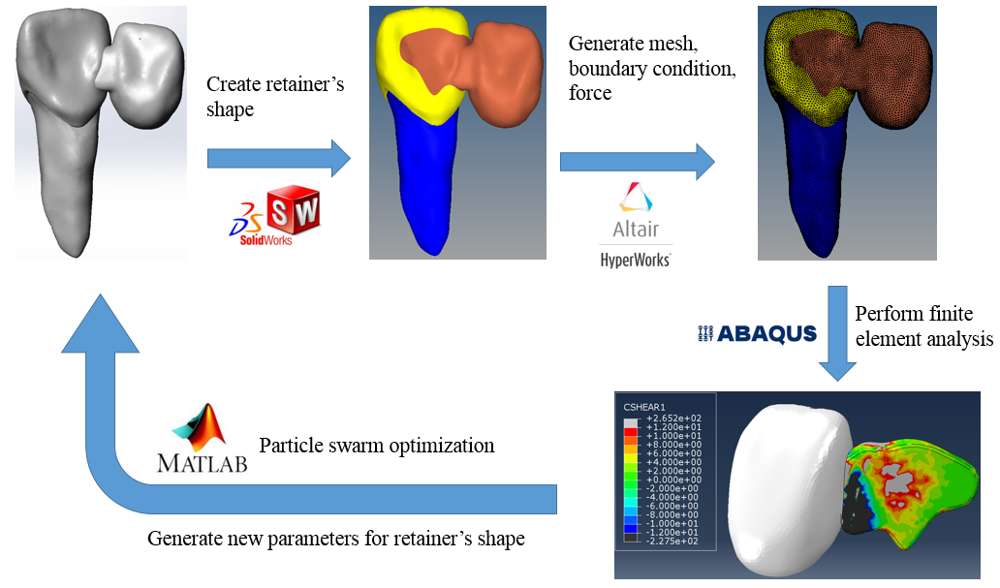

# RBFPD_desgin
This project can automatically optimize the shape of RBFPD.

## Software used
* MATLAB
* SolidWorks 2017
* Hypermesh 13.0
* ABAQUS 6.14-2

## Main process
  The automated optimization process was as follows. First, the retainer’s shape was created using the software SolidWorks. Second, the software Hypermesh was used to generate high quality meshes, to apply a distributed load was applied to the pontic of the RBFPD, and to assign fixed boundary condition to both sides of the cuboid. Third, the finite element model was solved using the software ABAQUS for stresses at the interface between the RBFPD and central incisor. Finally, the values of tensile stress and shear stress at the interface between retainer and prepared tooth were examined. The area with stresses higher than the preset of adhesive’s bonding strengths was summed up as the total debonding area. The particle swarm optimization(PSO) algorithm was implemented to minimize the total debonding area and to generate new design variables for retainer’s shape. The complete process was shown below.
  


___

The key of the process is the particle swarm optimizaion (PSO). The first step is to initialize PSO, which is not automated.

* Use ```main_initial.m``` to build the 40 initial RBFPD shape
1. Call Solidwroks (```call_solidworks(0,i)```) to build .STEP file
1. Call Hypermesh (```call_hypermesh(0,i)```)to build .hm .inp file
1. Make sure every .STEP .hm and .inp  file exist
1. Call ABAQUS (```call_abaqus(0,i)```)to build .odb file
1. Run ```ReadOdb()``` to calculate the total debonding area, and area.csv file will be created
1. Change the ```area.csv``` file to ```area_initial.csv```

* Use ```PSO.m``` to run the automated optimization process
1. Run it and wait for several hours

* The optimal result will show in the ```Best.txt``` file
* The debonding area and the parameters of every shape is recorded in ```position_area.txt```
* Use ```traditional.m``` to build RBFPD of tradtional design
